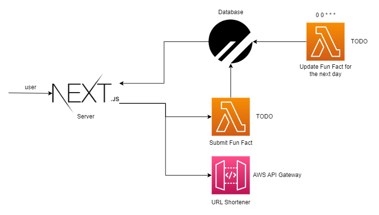

# Fun

This project consists on a fullstack app to build a platform to host Fun Facts.
It also doubles as a POC implementation of Feature Flags.
Hence the codename of this project is F.F.

## Stack

This project was created with the [T3 Stack](https://create.t3.gg/), which
consists of:

- [Next.js](https://nextjs.org)
- [Prisma](https://prisma.io)
- [Tailwind CSS](https://tailwindcss.com)
- [tRPC](https://trpc.io)

Aside from that, it also features:

- (Micro)services written in Go, deployed on AWS with Lambda.
- [Planetscale](https://planetscale.com/) as a database. It is a MySQL
  distributed database service implemented with [Vitess](https://vitess.io/).
  (Planetscale also happens to feature a really friendly free tier 🙂).
  The distributed nature of Vitess affects how relations work, more info about
  it [here](https://www.prisma.io/docs/guides/database/using-prisma-with-planetscale#commonalities-with-other-database-providers).

## Architecture



- The server is currently deployed to production with [Vercel](https://vercel.com/)
  (yet another generous free tier 😀).
- _"Why is there an URL Shortener in this project?"_ - Yes 😊 (it is also used
  to display the usage of Feature Flags).

## Getting Started

To run this project, `npm` must already be installed.

### Installing dependencies

```bash
npm install
```

### Defining environment variables

You should create a `.env` file that declares the variables displayed at the
`.env.example` file.

### Running a development server:

```bash
npm run dev
```

The server will start on port 3000.

### Running a production server:

```bash
npm run build
npm run start
```
